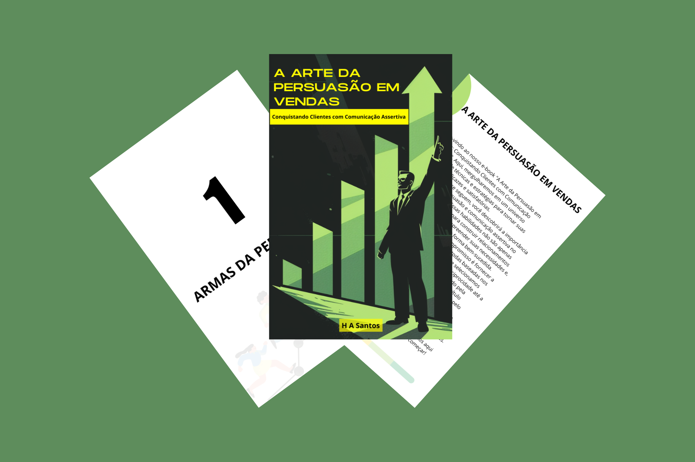

    

-------

# Projeto EBOOK Gerado por I.A.s

 > ℹ️ **NOTE:** Este é o repositório desenvolvido durante o curso no qual fui aluno na plataforma da [DIO](https://web.dio.me/users/hemersonfire?tab=achievements)

Projeto com o objetivo de gerar um ebook digital com as facilidades das ferramentas de IA. todos os prompts
seguem abaixo.

<a href="https://github.com/azimutalx/prompts-recipe-to-create-a-ebook/blob/main/output/A_Arte_da_Persuasao_em_Vendas.pdf" title="View PDF now"> 📕Clique aqui para ler</a>

## 💻 Tecnologias utilizadas no projeto

- [ChatGPT](https://chat.openai.com/) 
- [MidJourney](https://www.midjourney.com/app/)
- [Canva](https://www.canva.com/)

## 🧠 Prompts

ChatGPT：

|   Ação   | prompt                                                                                                                                                                                                                                                                         |
| :------: | ------------------------------------------------------------------------------------------------------------------------------------------------------------------------------------------------------------------------------------------------------------------------------ |
|  Enredo  | Gostaria de um resumo detalhado sobre os seguintes livros: |
|  título  | Com base nesses 7 livros quero escrever meu ebook, voltado para o nicho de vendas, e com subnicho a formação de excelentes vendedores. Quero um título impactante utilizando das técnicas fornecidas pelos livros e curto.  |  
| conteúdo | Se aprofunde mais nos temas, crie um subtítulo que seja uma citação breve do livro, traga exemplos reais do cotidiano da área de vendas. Inclua também as seguintes regras: \{REGRAS\} \> Cada tópico deve possuir no mínimo 800 caracteres, incluindo espaços \> O Autor é CEO de uma distribuidora de cigarros aplicando sua experiência nesse ebook \> Não utilize sempre o termo "Como CEO de uma distribuidora de cigarros" \> O público-alvo são vendedores externos \> Extraia de maneira minuciosa \> Faça uma análise em cada livro \> Utilize somente as ideias dos livros \> Traga vivência para a área de vendas do comércio geral \> De exemplos para o vendedor externo de cigarros |
| conclusão | Traga uma conclusão sobre todo o conteúdo abordado e sobre o conteúdo dos livros estudados, diga que agora o vendedor subiu de nível e que indicamos os livros. Inclua também as regras mencionadas anteriormente: \{REGRAS\} \> Cada tópico deve possuir no mínimo 800 caracteres, incluindo espaços \> O Autor é CEO de uma distribuidora de cigarros aplicando sua experiência nesse ebook \> Não utilize sempre o termo "Como CEO de uma distribuidora de cigarros" \> O público-alvo são vendedores externos \> Extraia de maneira minuciosa \> Faça uma análise em cada livro \> Utilize somente as ideias dos livros \> Traga vivência para a área de vendas do comércio geral \> De exemplos para o vendedor externo de cigarros |

Midjourney：

|  Ação  | prompt                                                                                 |
| :----: | -------------------------------------------------------------------------------------- |
| título | A man in suit stands on the ground, pointing to an upward arrow next to him and standing behind it is green bar graph with black background. The illustration style should be simple yet detailed, using vector graphics for clarity of form and line work. This design will emphasize visual impact through clean lines and bright colors. A strong sense of composition, with elements such as arrows or graphs adding depth and dimension to create an overall positive atmosphere., focus stacked --ar 38:59 --style raw  |

## ✨ Features

- Conteúdo gerado via ChatGPT
- Imagens geradas via MidJourney

## 📚 Materiais

- Imagens utilizadas em `assets`
- ebook gerado durante as aulas em `output`

## 🛠️ Instruções de execução

Utilize os prompts acima nas ferramentas sugeridas para gerar o material base e utilize uma ferramenta de edição de documentos como power point, libreoffice , indesign para diagramação.

## 👨‍💻 Expert

    
    
&nbsp&nbsp&nbspHemerson Abreu 
    &nbsp&nbsp&nbsp
    <a href="https://github.com/azimutalx">
    GitHub</a>&nbsp;|&nbsp;
    <a href="www.linkedin.com/in/
hemersonabreu">LinkedIn</a>
&nbsp;|&nbsp;
    <a href="https://www.instagram.com/hemersonabreu/">
    Instagram</a>
&nbsp;|&nbsp;

  

---

⌨️ com 💜 por [Hemerson Abreu](https://github.com/azimutalx)
